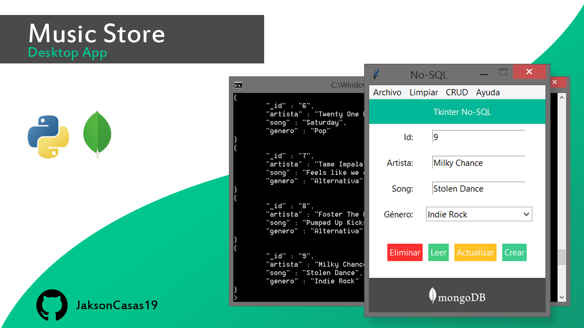

# TkinterNoSQL🌳
MusicStore Desktop application developed in Python Tkinter and connected to MongoDB 

***

Python GUI App with Tkinter |
<b>Data base</b> MongoDB

Con ❤️ por [JaksonCasas19](https://github.com/JaksonCasas19) 😊
